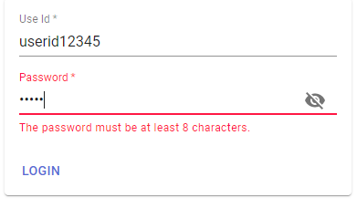

# mobx-json (The package is under development and not published)

[](https://badge.fury.io/js/%40mobx-json%2Fmui-form)
[](https://david-dm.org/thundermiracle/mobx-json?path=mobx-json-mui-form)
[](https://david-dm.org/thundermiracle/mobx-json?type=dev)
[](https://circleci.com/gh/thundermiracle/mobx-json)
[](https://codecov.io/gh/thundermiracle/mobx-json)
[](https://app.netlify.com/sites/mobx-json/deploys)

The simplest way to manage your form in React.

State management is charged by mobx, but you can use the materia-ui wrapped one without any knowledge of it.

You can check some examples here: [https://mobx-json.thundermiracle.com](https://mobx-json.thundermiracle.com)

## Table of Contents

* [Installation](#Installation)
* [How to use](#How-to-use)
* [A more useful sample](#A-more-useful-sample)
* [How to define blueprint](#How-to-define-blueprint)
  * [settings](#settings)
    * [widget](#widget)
    * [valueType (optional)](#valueType-(optional))
    * [rule (optional)](#rule-(optional))
    * [propRule (optional)](#propRule-(optional))
    * [computeRule (optional)](#computeRule-(optional))
  * [attrs](#attrs)
  * [Components](#Components)
    * [GridItemContainer](#GridItemContainer)
    * [Checkbox](#Checkbox)
    * [Checkboxes](#Checkboxes)
    * [Data](#Data)
    * [Display](#Display)
    * [Password](#Password)
    * [PasswordOutlined](#PasswordOutlined)
    * [Radio](#Radio)
    * [Select](#Select)
    * [SelectOutlined](#SelectOutlined)
    * [Switch](#Switch)
    * [TextField](#TextField)
    * [TextFieldOutlined](#TextFieldOutlined)
* [How to use in React](#How-to-use-in-React)
  * [Initialize (optional)](#Initialize-(optional))
  * [Generate form](#Generate-form)
    * [useMuiJsonForm's parameters](#useMuiJsonForm's-parameters)

## Installation

```shell
npm i -S @mobx-json/mui-form

or

yarn @mobx-json/mui-form
```

## How to use

1. Define your form in JSON or javascript.

    ```json
    {
      "fields": [
        {
          "settings": {
            "widget": "TextField",
            "rule": "required|min:3"
          },
          "attrs": {
            "name": "id",
            "label": "Use Id",
            "placeholder": "input your user id"
          }
        },
        {
          "settings": {
            "widget": "Password",
            "rule": "required|min:8"
          },
          "attrs": {
            "name": "password",
            "label": "Password",
            "placeholder": "at least 8 chars"
          }
        }
      ]
    }
    ```

1. Create the form

    ```js
    import { useMuiJsonForm } from '@mobx-json/form';
    import LoginFormJson from './blueprints/login-form.json';

    const IndexPage = props => {
      const { form, submitWithCheck } = useMuiJsonForm({
        blueprint: LoginFormJson,
      });

      const handleSubmit = React.useCallback(async () => {
        const data = submitWithCheck();
        if (data) {
          await tryLogin(data);
        }
      }, [submitWithCheck]);

      // the following one is material-ui, you can use native ones as well
      return (
        <Container maxWidth="xs">
          <Card>
            <CardContent>{form}</CardContent>
            <CardActions>
              <Button color="primary" onClick={handleSubmit}>
                LOGIN
              </Button>
            </CardActions>
          </Card>
        </Container>
      );
    }
    ```

1. Display

    

## A more useful sample

[./examples/mui-form](./examples/mui-form)

## How to define blueprint

The blueprint _MUST_ be defined as follows.

```json
{
  "fields": [
    ...
  ]
}
```

Each field should contains 3 parts including [settings](#settings), [attrs](#attrs) and [fields](#fields) (which is only necessary for settings.valueType = container).

* normal component

  ```json
  {
    "fields": [
      {
        "settings": {
          "widget": "TextField",
          "valueType": "string"
          ...
        },
        "attrs": {
          "name": "firstName"
          ...
        }
      }
    ]
  }
  ```

* container

  ```json
  {
    "fields": [
      {
        "settings": {
          "widget": "GridItemContainer",
          "valueType": "container"
          ...
        },
        "attrs": {
          "name": "baseInfoGrid"
          ...
        },
        "fields": [
          {
            "settings": {
              "widget": "TextField",
              "valueType": "string"
              ...
            },
            "attrs": {
              "name": "firstName"
              ...
            }
          }
        ]
      }
    ]
  }
  ```

### settings

To define which component to use and validation, etc.

exp:

```json
{
  "settings": {
    "widget": "TextField", // required
    "valueType": "string", // default: string
    "rule": "required"
  }
}
```

generate: ```TextField``` component and display error if input is empty.

| Property | Required | Type | Default | Description |
|:---------:|:--------:|:----:|:--------|:------------|
| widget | 〇 | string |  | 1. [components](components) contained in the package(TextField, Select...) <br /> 2. component you passed by widgetMap <br /> 3. native component in html(div, span...) |
| valueType | | string | ```string``` | one of ```number, string, array, boolean, container``` |
| rule |  | string | null | using [validatorjs](https://github.com/skaterdav85/validatorjs) as default validation tool, you can check the default validation rules [here](https://github.com/skaterdav85/validatorjs#available-rules) |
| propRule |  | string | null | rule to apply prop dynamically by input values. |
| computeRule |  | string | null | rule to compute value dynamically by target fields' value. |

#### widget

Folloing basic components are included in this package for quicker start: [Checkbox](#Checkbox), [Checkboxes](#Checkboxes), [Display](#Display), [Password](#Password), [PasswordOutlined](#PasswordOutlined), [Radio](#Radio), [Select](#Select), [SelectOutlined](#SelectOutlined), [Switch](#Switch), [TextField](#TextField), [TextFieldOutlined](#TextFieldOutlined).

#### valueType (optional)

  As every value from e.target.value is convertted into string, we have to define a correct valueType to format.

  ※ container: a special valueType which means sub fields are contained

#### rule (optional)

A rule to validate the input.

exp: ```"rule": "required|max:30"``` will throws error if input is empty or over 30.

※ [here for details](https://github.com/skaterdav85/validatorjs)

※ [sample page](https://mobx-json.thundermiracle.com/modifyform)

#### propRule (optional)

Apply defined prop to attrs if meets theYou can define multiple propRule and split them by __|__

Format:

```text
propName,propValueWhenMeetCondition,propValueType:targetFieldName,targetFieldValue

* Which means if (targetFieldName.value == targetFieldValue) set propName->propValue
```

exp: ```"propRule": "hidden,true,boolean:firstName,Daniel"``` will hide the component when the _firstName_ equals 'Daniel'.

※ [sample page](https://mobx-json.thundermiracle.com/proprule)

#### computeRule (optional)

Compute by other fields value. You can define multiple computeRule and split them by __|__, but the last rule will win.

Format:

```text
computeMethod:targetFieldName1,targetFieldName2,targetFieldName3...:extraInfo
```

Now supports 2 computeMethods:

* concat

  concat all targetFields' value into one string

  exp: ```"computeRule": "concat:firstName,lastName:, "```
  
  When firstName is _'Daniel'_, lastName is _Wood_, component's value will automatically changed to _'Daniel, Woo'_.

* sum

  sum all targetFields' value include string numbers. return 0 if character is contained.

  exp: ```"computeRule": "sum:profit1,profit2"```
  
  When profit1 is _100_, profit2 is _200_, component's value will automatically changed to _300_.

  ※ [sample page](https://mobx-json.thundermiracle.com/computerule)

### attrs

All props defined in attrs will be passed to each component. And attrs.```name MUST``` be unique in each form.

exp:

```json
{
  "settings": {
    "widget": "TextField",
    "valueType": "string"
  },
  "attrs": {
    "name": "firstName",  // required & MUST be unique
    "label": "First Name",
    "placeholder": "input your first name"
  }
}
```

generates:

```js
<TextField name="firstName" label="First Name" placeholder="input your first name" />
```

Extended props in every component:

| Property | Required | Type | Default | Description |
|:---------:|:--------:|:----:|:--------|:------------|
| grid | | object | ```{ "xs": 12 }``` | responsive grid layout. Automatically add _xs=12_ to every component unless _noGrid_ is ```true```. <br /> See [here for details.](https://material-ui.com/components/grid/#grid-with-breakpoints) |
| noGrid | | boolean | ```false``` | if ```true```, grid will be ignored |
| defaultValue | | any | null | applied to ```value``` if it's undefined |
| value | | any | null | ```value``` for display |
| keepLabelSpace | | boolean | ```false``` | if ```true```, margin-top: 16px |
| icon | | string | | 1. iconsMap MUST be passed in initialization. see [iconsMap example](/examples/mui-form/src/settings/iconsMap.js) and [how to initialize](/examples/mui-form/src/pages/_app.jsx). <br /> 2. icon is one of the keys defined in iconsMap.js. <br /> 3. IconComponent will be passed to each component. |
| itemsSource | | string | | 1. itemsSource MUST be passed in initialization. see [itemsSource example](/examples/mui-form/src/settings/itemsSource.js) and [how to initialize](/examples/mui-form/src/pages/_app.jsx). <br /> 2. itemsSource is one of the keys defined in itemsSource.js. <br /> 3. itemsSource will be converted to items and passed to each component. <br /> 4. Available in [Radio](#Radio), [Checkboxes](#Checkboxes) component |

### Components

Check the example page:

* [Normal Design](https://mobx-json.thundermiracle.com/modifyform).
* [Outlined Design](https://mobx-json.thundermiracle.com/modifyformoutlined).

#### GridItemContainer

rest props are the same with [material-ui's Grid component](https://material-ui.com/api/grid/#props).

```json
{
  "settings": {
    "widget": "GridItemContainer", // required
    "valueType": "container" // required
    ... // others like propRule
  },
  "attrs": {
    "name": "nameGrid", // required
    "divider": false, // show divider in the bottom of the Grid component if true
    "primary": '', // primary text size h4 in Grid
    "primaryProps": {}, // props for primary text's typography
    "secondary": '', // secondary text size body2 under the primary text
    "secondaryProps": {}, // props for secondaryProps text's typography
    "subPrimary": '', // subPrimary text size h6 right of the primary text
    "subPrimaryProps": {}, // props for subPrimaryProps text's typography
    "hidden": false, // hide all sub fields if true (propagate hidden prop to all children)
    "disabled": false, // disable all sub fields if true (propagate disable prop to all children)
    ...rest props
  }
}
```

#### Checkbox

rest props are the same with [material-ui's Grid component](https://material-ui.com/api/checkbox/#props).

```json
{
  "settings": {
    "widget": "Checkbox",
    "valueType": "boolean",
    "rule": "required" // invalid if not checked
  },
  "attrs": {
    "name": "subscription",
    "label": "Subscribe the news letter!"
    ...rest props
  }
}
```

#### Checkboxes

```json
{
  "settings": {
    "widget": "Checkboxes",
    "valueType": "array",
    "rule": "required"
  },
  "attrs": {
    "name": "interest",
    "label": "Your Interests",
    "selectAll": false, // if true, show SelectAll checkbox
    "selectAllLabel": "ALL",  // default label of SelectAll checkbox is ALL
    "icon": "", // get IconComponent from iconsMap
    "itemsSource": "", // get items definition from itemsSource
    "items": [   // items MUST be an array with label&value
      {
        "label": "Movie",
        "value": 1
      },
      {
        "label": "Gaming",
        "value": 2
      },
      {
        "label": "Coding",
        "value": 3
      }
    ]
  }
}
```

#### Data

For keeping data and will not be rendered.

exp:

```json
{
  "settings": {
    "widget": "Data"
  },
  "attrs": {
    "name": "id"
  }
}
```

#### Display

For display and format value. [See examples](https://mobx-json.thundermiracle.com/detailform).

formatters:

* date: yyyy/MM/dd HH:mm:ss
* time: HH:mm
* age: compute age
* digit: toLocaleString() (1234 -> 1,234)

```json
{
  "settings": {
    "widget": "Display"
  },
  "attrs": {
    "name": "birthday",
    "label": "Birthday",
    "icon": "Today",
    "format": {
      "type": "date",
      "template": "yyyy年MM月dd日"
    }
  }
}
```

#### Password

#### PasswordOutlined

#### Radio

#### Select

#### SelectOutlined

#### Switch

#### TextField

#### TextFieldOutlined

## How to use in React

Package is using hook to make the form and return submit functions. React > 16.8 is needed.

### Initialize (optional)

Need if ```icon, itemsSource``` is used, use customized components or display self-defined error messages.

[See example](/examples/mui-form/src/pages/_app.jsx).

| Parameter | Required | Type | Default | Description |
|:---------:|:--------:|:----:|:--------|:------------|
| locale | | string | ```en``` | [validatorjs' locale string](https://github.com/skaterdav85/validatorjs/tree/master/src/lang) |
| messages | | object | {} | key-value object for extended error messages|
| itemsSource | △ | object | {} | key-value object for items definition. <br /> ※ required if ```itemsSource``` is used in blueprint |
| iconsMap | △ | object | {} | key-value object for IconComponent definition. <br /> ※ required if ```icon``` is used in blueprint |
| extraWidgetMap | | object | {} | key-value object for extra Widget(component) |

* initialize example:

  ```js
  import { initialize } from '@mobx-json/mui-form';

  initialize({
    locale: 'zh',
    messages,
    itemsSource,
    iconsMap,
    extraWidgetMap
  });
  ```

* itemsSource example:

  ```js
  export default {
    City: [
      {
        label: '東京都',
        value: 'tokyo',
      },
      {
        label: '神奈川県',
        value: 'kanagawa',
      },
      {
        label: '千葉県',
        value: 'chiba',
      },
    ],
    Sex: [
      {
        label: 'Male',
        value: 0,
      },
      {
        label: 'Female',
        value: 1,
      },
      {
        label: 'Other',
        value: -1,
      },
    ],
  }
  ```

* iconsMap example:

  ```js
  import AccountCircle from '@material-ui/icons/AccountCircle';
  import ContactMail from '@material-ui/icons/ContactMail';
  
  export default {
    AccountCircle,
    ContactMail,
  };
  ```

* extraWidgetMap example:

  ```js
  import MyTextField from './MyTextField';

  export default {
    AdvancedTextField: MyTextField,
  };
  ```

### Generate form

Use hook useMuiJsonForm to generate form.

example:

```js
import { useMuiJsonForm } from '@mobx-json/mui-form';

const { form, submitWithCheck, setData, setBlueprint } = useMuiJsonForm({
  blueprint,
  formUniqName,
  data,
});

// load data after mounted
React.useEffect(async () => {
  const dataFromServer = await readDataFromServer();
  setData(dataFromServer);
}, []);

// save to server if validation pass
const handleSubmit = React.useCallback(async () => {
  const submitData = submitWithCheck();
  if (submitData) {
    await saveDataToServer(submitData);
  }
}, [submitWithCheck]);
```

[See example](/examples/mui-form/src/views/SampleForm/SampleForm.jsx).

#### useMuiJsonForm's parameters

| Parameter | Required | Type | Default | Description |
|:---------:|:--------:|:----:|:--------|:------------|
| blueprint | 〇 | object | | blueprint for rendering form. [See details](#How-to-define-blueprint). |
| formUniqName | △ | string | '' | necessary if define multiple forms in one page, or auto focus when errors occur will fail.  |
| data | | object | {} | data for form in initialization |
| options | | object | ```{ smoothScroll: true, gridContainerProps: {} }``` | 1.  smoothScroll: if true, append style ```scroll-behavior:smooth;``` to the lastest ```overflow: auto;``` component. <br /> 2. gridContainerProps: props appled to root grid container |

#### useMuiJsonForm's output

useMuiJsonForm returns an object contains following parameters:

| key | Type | Description |
|:---------:|:--------:|:------------|
| form | React.Element | React form generated by blueprint |
| submitWithCheck | Function | validate all inputs, if ok, returns inputed data; if not, returns false and automatically focus the first error field.  |
| setData | Function | apply ```data object``` to form |
| setBlueprint | Function | apply a new blueprint. <br /> ※ re-render all fields! |

## License

This project is licensed under the terms of the [MIT license](/LICENSE).
